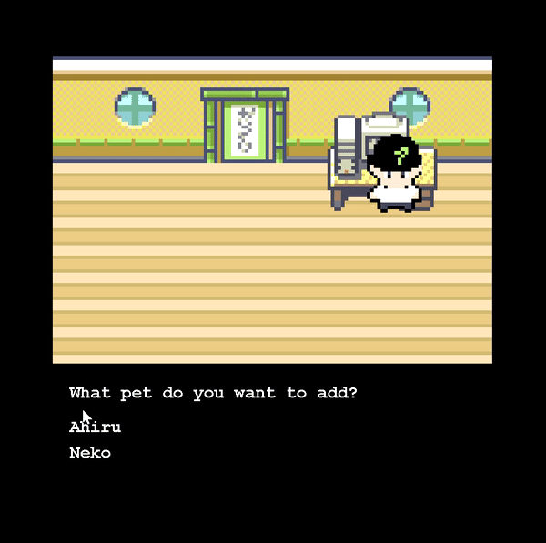

# Gotchimon



A 2D pet simulator game written from scratch using Java and AWT. THe game includes a save/load system, a custom UI and settings. 

## Prerequisites
- Java 14

## build
```sh
javac -sourcepath src/main/java/  -d ./out  src/main/java/com/kodokoto/gotchimon/App.java && cp -r src/main/resources/maps out && cp -r src/main/resources/sprites out/sprites && cp -r src/main/resources/saves out/saves
```

## run

```sh
java -cp ./out com.kodokoto.gotchimon.App
```